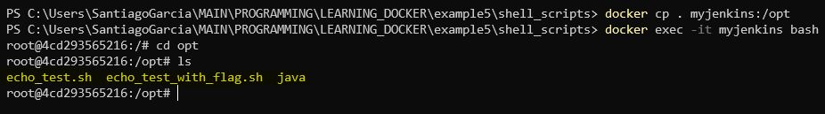

 # Multiple Jenkins Jobs Run with Parameters in Cool Ways

These are a series of notes for the Jenkins Udemy course.

We should have Jenkins already installed (via Docker or locally).

To execute all of these tutorials, we are going to use a Docker container that has Jenkins running and already configured (see previous tutorials for those steps).

---

## JOB 1: RUN A BASH SCRIPT FROM A JENKINS JOB PASSING ARGUMENTS AS STRING PARAMETERS

### Create a bash Script in our Local Machine

Lets create the bash script (in our host machine). I will name it "echo_test.sh".

```bash
#!/bin/bash

# Argument parameters when executing script
NAME=$1
LASTNAME=$2

# Main script output (to show it in terminal)
echo "Hello $NAME $LASTNAME"
```

### Copy the created bash Script to the running Jenkins Docker Container

Now we should copy the bash file from our host computer, to docker container (the one with Jenkins).

We will copy the bash script to the folder "$/opt/" in Jenkins' Container.

To do this, we should be in the terminal at the same level as the bash script.

```bash
docker cp echo_test.sh myjenkins:/opt
```

### Verify that the bash Script was Copied Correctly

To verify correct usage, we can now enter the docker container of Jenkins and we should be able to see the "echo_test.sh" in the "opt" folder.

Enter the running Jenkins container in an interactive way with terminal.

```bash
docker exec -it myjenkins bash
```

Inside the Jenkins Docker container, we should be able to find the "echo_test.sh"

```bash
cd opt
ls
```


Expected result for our echo_test.sh in the Jenkins Docker container.

### Create Jenkins Job to Run bash Script with Custom Parameters

To be able to accomplish this, we must create a Jenkins Job and in the "Build" part, lets add add the option "execute shell".

Then, lets add the local path for the "echo_test.sh" script, to the Jenkins job, so that it can run the script in the shell execution.

```bash
NAME=Santiago
LASTNAME=Garcia

/opt/echo_test.sh $NAME $LASTNAME
```


How to create the "execute shell" in Jenkins to run the local container script.

### Expected Output for our Job

When we run the Jenkins created job, we should be able to see an amazing result:


Results after building created job with correct output.

---

## JOB 2: RUN A BASH SCRIPT FROM A JENKINS JOB PASSING ARGUMENTS AS CHOICE PARAMETERS

This tutorial uses the "echo_test.sh" script created in the JOB 1, so that we keep that in mind.

### Create Jenkins Job with Parameters

In the creation of the Job, we add a new configuration for multiple parameters as input. This can be done in "this project is parameterized".


Add parameters to the project.

After creating the parameters, we should create the shell execution at build time like this:


Add build execute shell.

### Run Jenkins Job with Parameters

After creating the Job parameterized, we should be able to run it in this special way (with specific parameters as input).


How to run Jenkins' Job with our own custom parameters as specific limited inputs.

---

## JOB 3: RUN A BASH SCRIPT FROM A JENKINS JOB PASSING ARGUMENTS AS CHOICE PARAMETERS AND BOOLEAN PARAMETER

In this tutorial, we will create a new "echo_test_with_flag.sh" so that it can handle a Boolean value and add a conditional decision based on it.

### Create a Coolebash Script in our Local Machine

Lets create the bash script (in our host machine). I will name it "echo_tes_with_flagt.sh".

```bash
#!/bin/bash

# Argument parameters when executing script
NAME=$1
LASTNAME=$2
SHOW_OUTPUT=$3

# Main script output (to show it in terminal  if activated flag)
if [ "$SHOW_OUTPUT" = "true" ]; then
    echo "Hello $NAME $LASTNAME"
else
    echo "Mark the SHOW_OUTPUT flag to see message"
fi
```

### Copy the created bash Script to the running Jenkins Docker Container

Now we should copy the bash file from our host computer, to docker container (the one with Jenkins).

We will copy the bash script to the folder "$/opt/" in Jenkins' Container.

WARNING: now we have 2 scripts in the Host Machine folder. To avoid deleting the old bash script, we should copy the folder with the " . " dot approach, instead of the complete script name.

To do this, we should be in the terminal at the same level as the folder with the created custom bash scripts.

```bash
docker cp . myjenkins:/opt
```

### Verify that the bash Script was Copied Correctly

To verify correct usage, we can now enter the docker container of Jenkins and we should be able to see the "echo_test_with_flag.sh" in the "opt" folder.

Enter the running Jenkins container in an interactive way with terminal.

```bash
docker exec -it myjenkins bash
```

Inside the Jenkins Docker container, we should be able to find the "echo_test_with_flag.sh"

```bash
cd opt
ls
```



Expected files in the Docker Jenkins' container for the folder "opt".

### Create Jenkins Job with Parameters

In the creation of the Job, we add a new configuration for multiple parameters as input. This can be done in "this project is parameterized".


Add NAME and LASTNAME parameters to the project as choice parameters.


Add SHOW_OUTPUT as Boolean parameter.

After creating the parameters, we should create the shell execution at build time like this:


Execute shell now has 3 parameters (with the flag to be able to show output or not).

### Run Jenkins Job with Parameters

After creating the Job parameterized, we should be able to run it in this special way (with specific parameters as input).

1. **WITH SHOW_OUTPUT FLAG**

    

    

2. **WITHOUT SHOW_OUTPUT FLAG**

    

    

---
