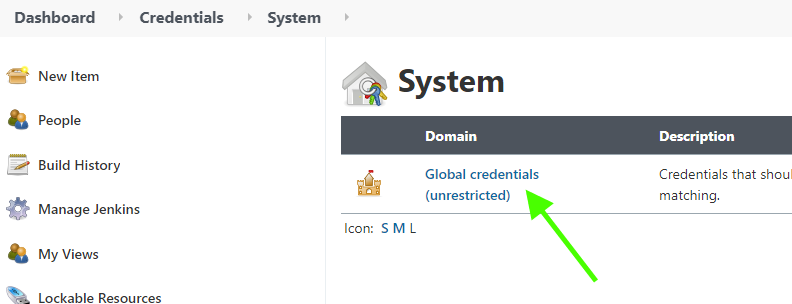
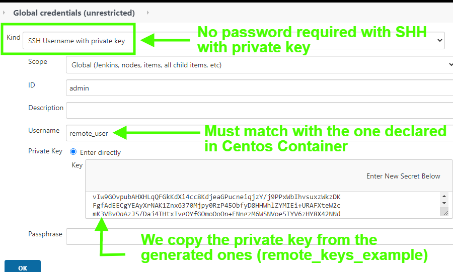

# Multiple Jenkins Features with SSH

These are a series of notes for the Jenkins Udemy course.

We should have Jenkins already installed (via Docker or locally).

In this tutorial, we will work with "remote" machines via SSH with Jenkins.

To execute all of these tutorials, we are going to use a Docker containers that have Jenkins running and already configured (see previous tutorials for those steps).

To simulate the "remote machine", we will use Docker to create it and handle it from another Jenkins' Docker container.

---

## PART 1: CREATE A "REMOTE MACHINE" WITH A DOCKER CONTAINER TO SIMULATE SSH CONNECTION

To accomplish this task, we will take advantage of Docker containers to run a container with a Centos image and then have it as a simulation for our "remote machine".

### Generate the ssh Keys in Host Machine

In our local machine, we open a terminal at the same level as the centos directory, we create the ssh keys.

```bash
ssh-keygen -f remote_keys_example
```


Result after generating ssh keys

This command will generate two keys:

1. remote_keys_example
2. remote_keys_example.pub

### Create the Dockerfile for the Centos Container

Check the "Dockerfile" in "centos" directory to see correct setup for this example.

REMARK: the ssh keys should be created before running the Dockerfile (otherwise it wouldn't find them).

### Create the docker-compose File

Check the "docker-compose.yml" file for this example.

### Execute the docker-compose Build and Up Operations

At the same level as the docker-compose file of this project, we run in terminal:

```bash
docker-compose build
```

When the build part is finished, we run:

```bash
docker-compose up -d
```


Expected output after running docker-compose correctly. If there is an error, try verifying newer configs for the centos docker container.

If it is the first time running the container for Jenkins, it is likely that we have to configure it first (accessing the password and a general Jenkins configure should be fine).

### Check that Jenkins' Container can Access the Remote Host Machine (Container) of Centos via Ping

While we have both containers running with the configuration specified in the docker-compose file, we can access the Jenkins' container "myjenkins_ssh" interactively and ping the remote host container "myremotehost".

```bash
# In terminal of host computer
docker exec -it myjenkins_ssh bash

# In Jenkins terminal (after previous command)
ping myremotehost
```


Expected result for a "ping" from the Jenkins container to the Centos container.

### Connecting Jenkins Container to Centos Container via SSH (example to understand the next connection)

After we checked the ping connection successfully, we can run the connection with a SSH connection based on the generated keys at the beginning.

At the same level as the generated keys (in centos directory), we run:

```bash
# Copy the private key to Jenkins container (test connection)
docker cp remote_keys_example myjenkins_ssh:/tmp

# Acces the Jenkins container in an interactive way
docker exec -it myjenkins_ssh bash

# Go to the "tmp" folder to check for the key "remote_keys_example"
cd tmp/

# Connect via ssh with ssh key (wihtout password THIS IS AN EXAMPLE)
ssh -i remote_keys_example remote_user@myremotehost
```


Expected correct result for the SSH connection to test the keys working properly.

### Jenkins SSH plugin

The example shown before is not the best approach, but it gives us an idea of how the SSH connections work.

For this part of the example, we will be running our Jenkins container (via the GUI) with the correct SSH configuration via the ssh-plugin.

1. Install Jenkins SSH plugin (this process needs installation and Jenkins' restart)

   

   Install Jenkins SSH plugin from "Manage Jenkins:" —> "Manage Plugins" —> "Available" —> "SSH".

2. Configure SSH keys in Jenkins Credentials

   

   

   

   

3. Configure Jenkins SSH Remote Host Settings in "Manage Jenkins" —> "Configure System" —> "SSH remote hots".

   

   If everything was configured ok, the message after running "Check connection" should be "Successful connection".

### Test Jenkins Job in the Configured Remote Host via SSH

First of all, lets create a new job in the Jenkins User Interface.


Now, lets configure the job with a shell script in a remote host using SSH:

```bash
NAME=Santi
EMOTION=happy
echo "Hello, my name is $NAME and I am $EMOTION" > /tmp/test
```


To test results, lets execute the build and we should see correct Jenkins' console output, and if we go to the "myremotehost" container, we can verify it in the specified path "/tmp/test".


To verify result in the remote host Docker container, we can execute:

```bash
# Run on Local Computer terminal to access the remote host
docker exec -it myremotehost bash

# Check specific generated file when running the shell script from Jenkins
cat /tmp/test
```


